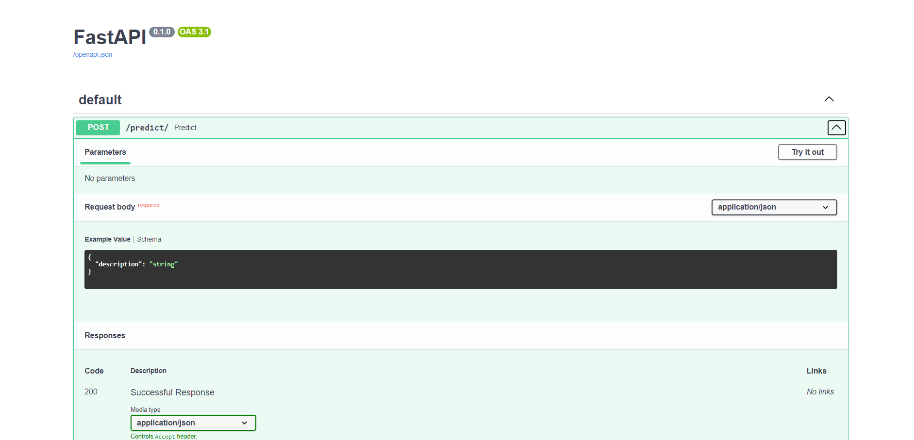

# Transformer Model for Predicting Internal Status

## Project Structure

The project is organized into five Python files:

- `preprocessing.py`: Contains code for preprocessing the data.
- `main.py`: The main script that calls functions from the other files.
- `train.py`: Contains code for training the models.
- `evaluate.py`: Contains code for evaluating the models.
- `models.py`: Contains the code for the different models.

# Transformer Model for Status Prediction

This project uses a Transformer model to predict internal status labels based on external status descriptions. The model is implemented using the TensorFlow library.

## Dataset

The dataset is a JSON file hosted on GitHub, which can be found [here](https://gist.github.com/farhaan-settyl/ecf9c1e7ab7374f18e4400b7a3d2a161). It contains pairs of external status descriptions and corresponding internal status labels. Here's an example of what the data looks like:

```json
[
  {
    "externalStatus": "PORT OUT",
    "internalStatus": "Port Out"
  },
  {
    "externalStatus": "TERMINAL IN",
    "internalStatus": "Inbound Terminal"
  },
]
```

Each object in the array represents a status update, with an externalStatus field that contains the status description visible to the customer, and an internalStatus field that contains the corresponding internal status label.

## Code

The code for this project is divided into several parts:

- Data Preprocessing: The preprocess_data function tokenizes the ‘externalStatus’ column and encodes the ‘internalStatus’ column. It then splits the data into training and test sets and saves the tokenizer and encoder for later use.
- Model Definition: The transformer_encoder function defines a single layer of a Transformer encoder. The create_transformer_model function builds the Transformer model using the previously defined encoder layer.
- Model Training: The train_model function trains the model using Stratified K-Fold cross-validation. This method ensures that each fold of the training data has the same proportion of samples from each class, which is important for imbalanced datasets.

## Model Comparison

Several machine learning models were evaluated, including SVM, Decision Tree, Random Forest, LSTM, CNN, and a Transformer model. Each model was trained on the same dataset and evaluated using the same metrics. The Transformer model was found to be the most effective, despite being more complex and slower than the other models. This suggests that the Transformer model's ability to handle long-term dependencies in the data is crucial for this task.

## Overfitting Prevention

To prevent overfitting, Stratified K-Fold cross-validation was used during model training. This ensures that the model is not overly fitted to the training data and can generalize well to unseen data.

## Model Saving and Training

To train the model, you need to run the `main.py` script. This script uses functions from the other Python files in the project to preprocess the data, train the model, and evaluate its performance.

Here are the steps to train the model:

1. Ensure that you have all the necessary Python packages installed. You can install the required packages using the command: `pip install -r requirements.txt`

2. Change your current directory to the directory containing `main.py` using the command: `cd path_to_directory`

3. Run the `main.py` script using the command: `python main.py`

This will start the training process. The script will output the performance of the model after the training is complete.

Please replace `path_to_directory` with the actual path to the directory containing `main.py`.

After training, the model and its weights are saved for later use. This allows the model to be loaded quickly without needing to be retrained. The model is saved using the following code:

`model.save('transformer_model.h5')`
`model.save_weights('transformer_weights.h5')`

## Model Performance Comparison

The performance of the models was evaluated using four metrics: Accuracy, Precision, Recall, and F1 Score. The results are presented in the table below:

| Model | Accuracy | Precision | Recall | F1 Score |
|-------|----------|-----------|--------|----------|
| Transformer | 0.9918 | 0.9921 | 0.9918 | 0.9918 |
| LSTM | 0.9306 | 0.9301 | 0.9306 | 0.9230 |
| CNN | 0.9859 | 0.9962 | 0.9959 | 0.9957 |
| SVM | 0.9836 | 0.9840 | 0.9836 | 0.9836 |
| Decision Tree | 0.9865 | 0.9763 | 0.9659 | 0.9957 |
| Random Forest | 0.9859 | 0.9962 | 0.9699 | 0.9967 |

The Transformer model achieved the highest scores on all four metrics, indicating that it performed the best on this task.

# API Development

The API is developed using the FastAPI framework. It accepts external status descriptions as input and returns the predicted internal status labels. 

The API code is as follows:
```python
from fastapi import FastAPI
from pydantic import BaseModel
import tensorflow as tf
import numpy as np
import joblib
from tensorflow.keras.preprocessing.sequence import pad_sequences
from tensorflow.keras.preprocessing.text import Tokenizer
from sklearn.preprocessing import LabelEncoder

# Define your custom function
def transformer_encoder(inputs, head_size, num_heads, ff_dim, dropout=0):
  # Normalization and Attention
  x = tf.keras.layers.LayerNormalization(epsilon=1e-6)(inputs)
  x = tf.keras.layers.MultiHeadAttention(key_dim=head_size,
                                         num_heads=num_heads,
                                         dropout=dropout)(x, x)
  x = tf.keras.layers.Dropout(dropout)(x)
  res = x + inputs

  # Feed Forward Part
  x = tf.keras.layers.LayerNormalization(epsilon=1e-6)(res)
  x = tf.keras.layers.Conv1D(filters=ff_dim, kernel_size=1,
                             activation='relu')(x)
  x = tf.keras.layers.Dropout(dropout)(x)
  x = tf.keras.layers.Conv1D(filters=inputs.shape[-1], kernel_size=1)(x)
  return x + res

# Define your model architecture
def create_transformer_model(num_classes):
  inputs = tf.keras.layers.Input(shape=(None, ), dtype=tf.int32)
  x = tf.keras.layers.Embedding(input_dim=5000, output_dim=16)(inputs)
  x = transformer_encoder(x,
                          head_size=256,
                          num_heads=4,
                          ff_dim=4 * 256,
                          dropout=0.1)
  x = transformer_encoder(x,
                          head_size=256,
                          num_heads=4,
                          ff_dim=4 * 256,
                          dropout=0.1)
  x = transformer_encoder(x,
                          head_size=256,
                          num_heads=4,
                          ff_dim=4 * 256,
                          dropout=0.1)
  x = tf.keras.layers.GlobalAveragePooling1D()(x)
  outputs = tf.keras.layers.Dense(
      num_classes,
      activation='softmax',
      kernel_regularizer=tf.keras.regularizers.l2(0.01))(x)
  model = tf.keras.models.Model(inputs=inputs, outputs=outputs)
  return model

# Define the number of unique classes in your data
num_classes = 15

# Create the model
model = create_transformer_model(num_classes)

# Load your saved weights into the model
model.load_weights('transformer_weights.h5')

# Load your tokenizer and encoder
tokenizer = joblib.load('tokenizer.joblib')
encoder = joblib.load('encoder.joblib')

app = FastAPI()

class Item(BaseModel):
  description: str

@app.post("/predict/")
async def predict(item: Item):
  # Preprocess the input
  processed_input = tokenizer.texts_to_sequences([item.description])
  processed_input = pad_sequences(processed_input, padding='post')

  # Make prediction
  prediction = model.predict(processed_input)

  # Postprocess the prediction
  predicted_label = np.argmax(prediction, axis=-1)
  processed_output = encoder.inverse_transform(predicted_label)

  return {"internalStatus": processed_output[0]}
```

## Testing this API on FastAPI /docs route and Postman




## To run the API, follow these steps

1. Change your current directory to Settyl_task/API using the command: `cd Settyl_task/API`
2. Install the required dependencies using the command: `pip install -r requirements.txt`
3. Run the API using a suitable command depending on how you have set up your environment. If you’re using uvicorn, for example, the command would be: `uvicorn main:app --reload`
4. The API will be running at localhost:8000 (if you’re using uvicorn). You can check the results at the /predict route by sending a POST request using curl or Postman.
Here’s an example of how to send a POST request:
`curl -X POST "http://localhost:8000/predict/" -H  "accept: application/json" -H  "Content-Type: application/json" -d "{\"description\":\"PORT OUT\"}"`

Replace "PORT OUT" with your actual description. The API will return the predicted internal status.
